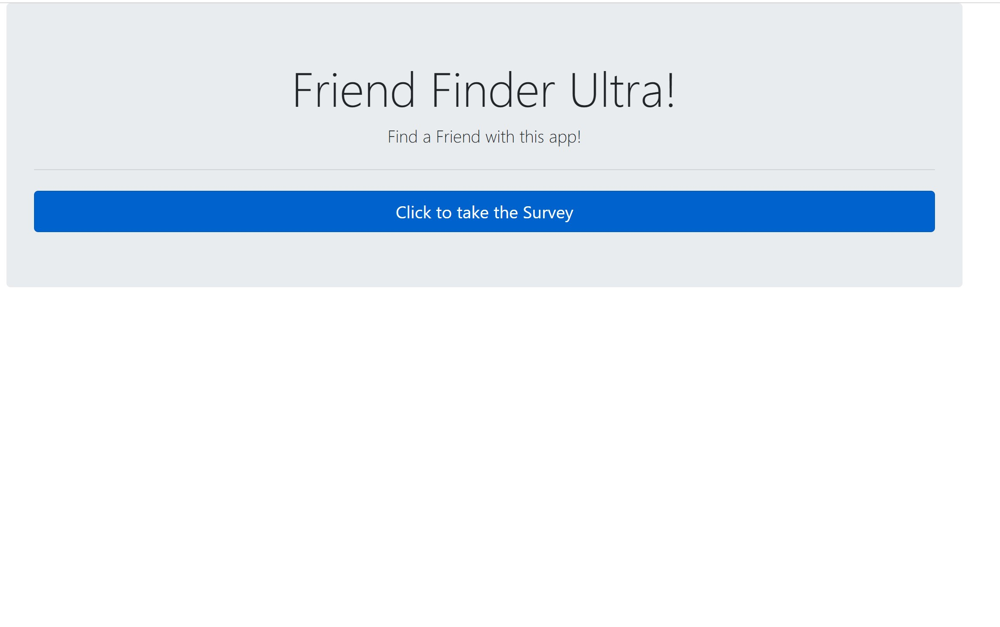
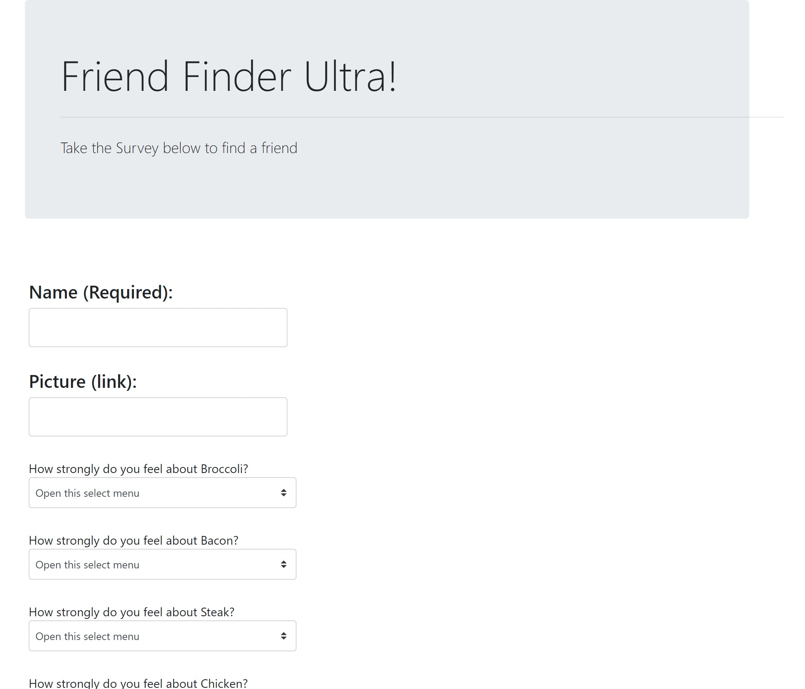

# Ultra Friend Finder
This is a mock friend finder app built using Node.js and Express.

## Demo
Live working demo of the site:  https://ultra-friend-finder.herokuapp.com/

Click on the link, enter your name (feel free to use a stock link for a your picture below, or supply your own), then take the survey!  

### Random "Friend Pics" to try (via Unsplash)  
Copy and paste these for pics:  
Female
* /pics/female2.jpg  
* /pics/female3.jpg  
* /pics/female4.jpg  
* /pics/female5.jpg  
Male  
* /pics/male3.jpg
* /pics/male4.jpg
* /pics/male5.jpg

----

----

----

### Technology
* JavaScript (of course!)
* Node.js
* Express.js

### Future Adds
* Re-style the Modal
* Single questions to screen, transition between each
* More Styling
* REACT!!* 

